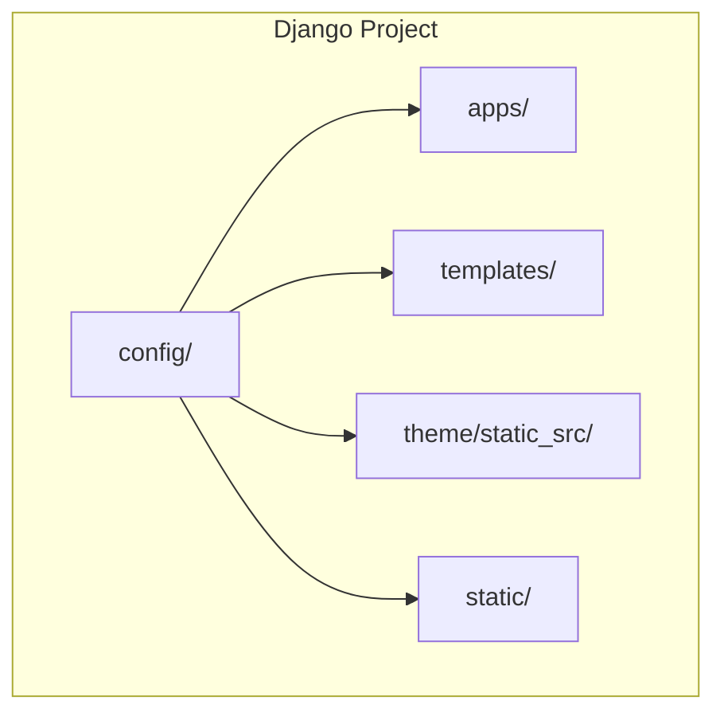
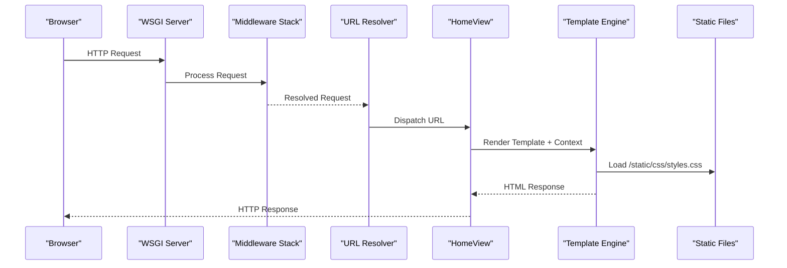
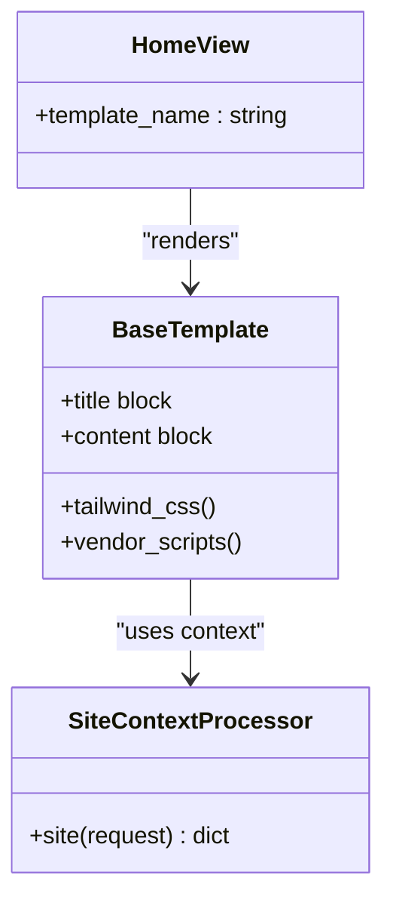
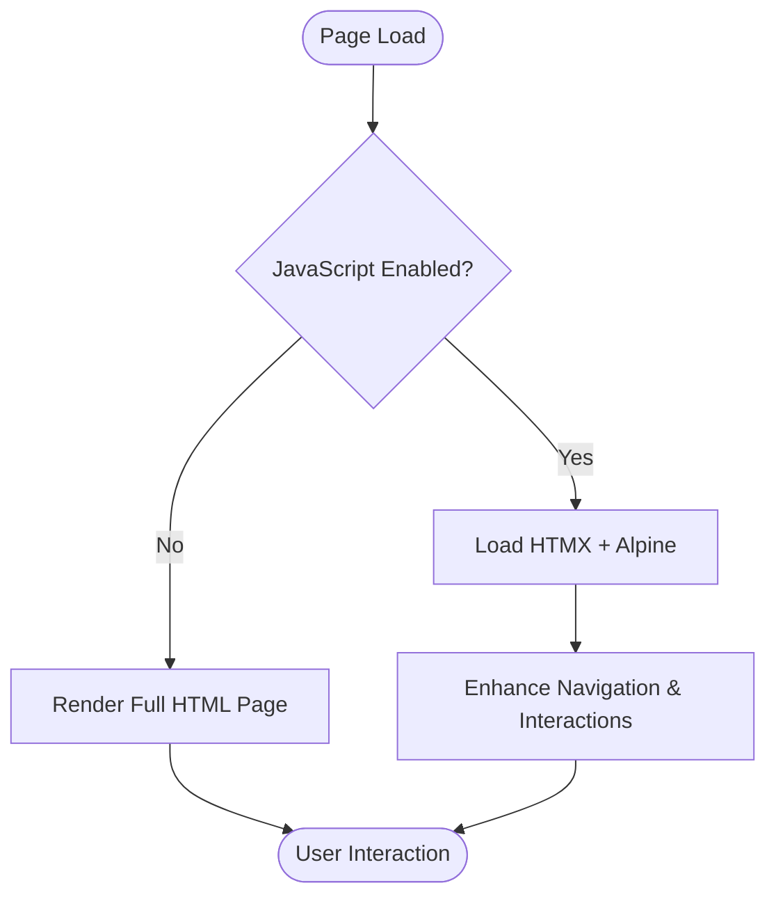
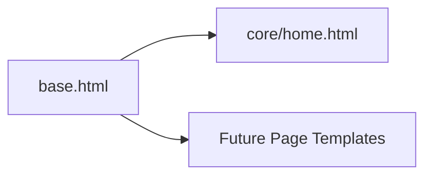
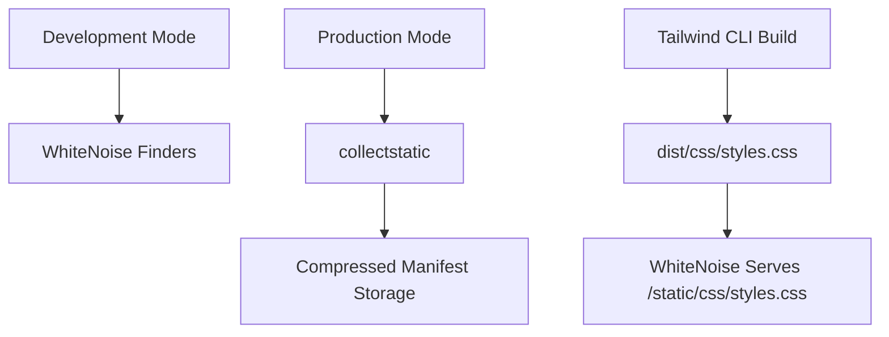
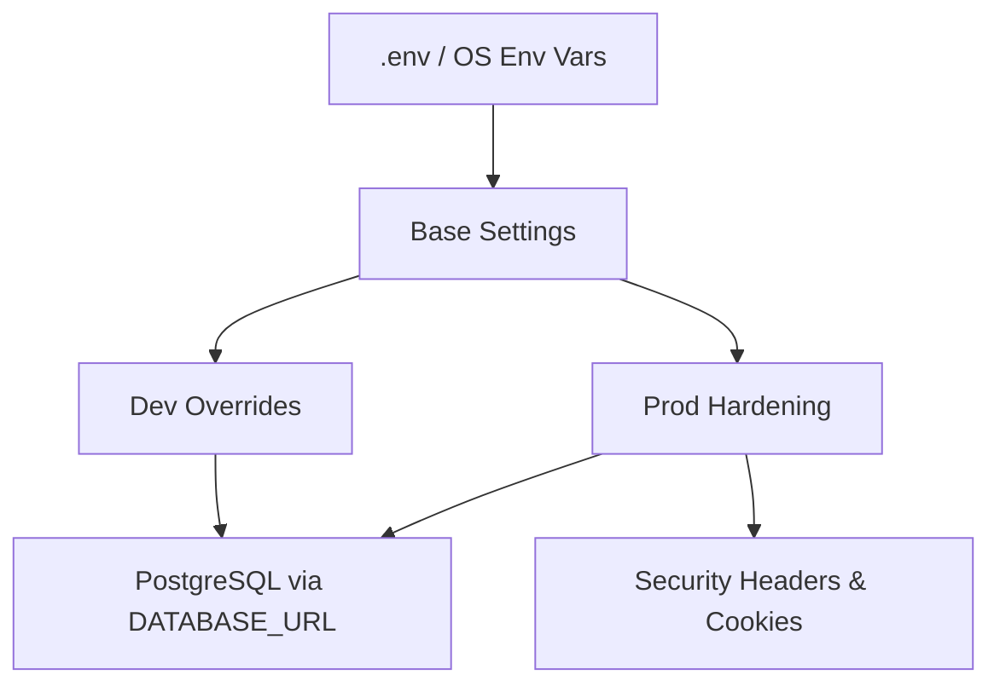
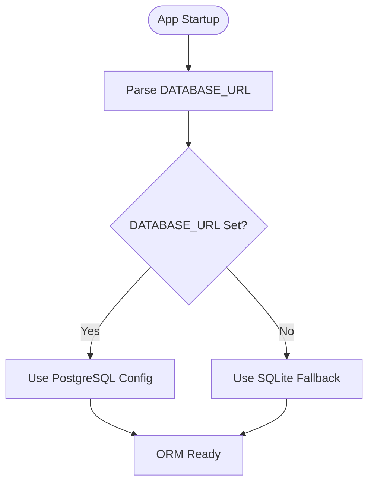
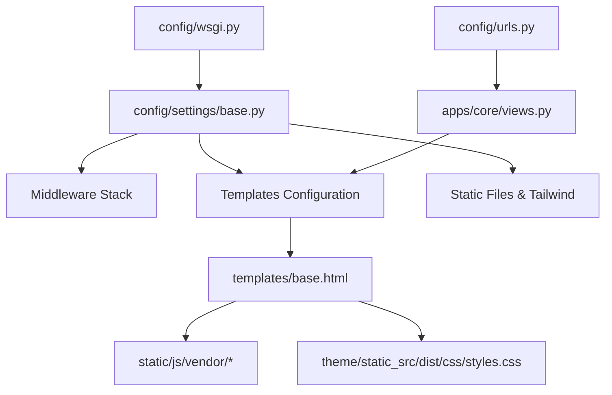

# Architecture Overview

<cite>
**Referenced Files in This Document**
- [README.md](file://README.md)
- [config/settings/base.py](file://config/settings/base.py)
- [config/settings/dev.py](file://config/settings/dev.py)
- [config/settings/prod.py](file://config/settings/prod.py)
- [config/urls.py](file://config/urls.py)
- [config/wsgi.py](file://config/wsgi.py)
- [templates/base.html](file://templates/base.html)
- [apps/core/views.py](file://apps/core/views.py)
- [apps/core/context_processors.py](file://apps/core/context_processors.py)
- [apps/core/models.py](file://apps/core/models.py)
- [apps/contact/models.py](file://apps/contact/models.py)
- [apps/news/models.py](file://apps/news/models.py)
- [apps/units/models.py](file://apps/units/models.py)
- [static/js/app.js](file://static/js/app.js)
- [theme/static_src/src/styles.css](file://theme/static_src/src/styles.css)
</cite>

## Table of Contents
1. [Introduction](#introduction)
2. [Project Structure](#project-structure)
3. [Core Components](#core-components)
4. [Architecture Overview](#architecture-overview)
5. [Detailed Component Analysis](#detailed-component-analysis)
6. [Dependency Analysis](#dependency-analysis)
7. [Performance Considerations](#performance-considerations)
8. [Troubleshooting Guide](#troubleshooting-guide)
9. [Conclusion](#conclusion)

## Introduction
This document describes the architecture of the Energicotel website system, a Django 5.2 application rebuilt from a WordPress site. The project follows a conventional Django MVC pattern with an app-based modular layout. It uses HTMX and Alpine.js for progressive enhancement to achieve SPA-like navigation while keeping pages functional without JavaScript. Templates inherit from a shared base shell, and static assets are served through WhiteNoise with Tailwind CSS v4 built via django-tailwind-cli. Settings are split across base, development, and production modules, with environment-driven configuration for security, database, and deployment concerns.

The repository is currently in Phase 1 scaffold: apps exist, URL routing is wired for the home view, and templates and models are placeholders pending later phases.

**Section sources**
- [README.md:1-33](file://README.md#L1-L33)

## Project Structure
At a high level, the project is organized as:

- `config/`: Django project configuration (settings, URLs, WSGI).
- `apps/`: Feature apps (`core`, `team`, `units`, `news`, `gallery`, `contact`).
- `templates/`: Shared template shell and per-app page templates.
- `theme/static_src/`: Tailwind CSS entry point and build output directory.
- `static/`: Vendored frontend libraries and application JavaScript.
- `requirements/`: Dependency sets for base, development, and production.
- `design_reference/`: Design tokens and screenshots used during design extraction.

**Diagram sources**
- [README.md:23-33](file://README.md#L23-L33)

**Section sources**
- [README.md:23-33](file://README.md#L23-L33)

## Core Components
- Django project configuration:
  - Base settings define installed apps, middleware stack, template context processors, static files, and database defaults.
  - Development and production settings override behavior for debugging, static serving, email, logging, and security hardening.
- URL routing:
  - Root URL configuration wires admin and the home view placeholder.
- Views and templates:
  - A generic template view renders the core home template.
  - A shared base template provides consistent HTML shell, Tailwind CSS inclusion, and vendor scripts.
- Context processors:
  - Site-wide contact information is exposed to templates via a context processor.
- Apps:
  - Placeholder models indicate planned domain entities for core content, business units, news, and contact forms.
- Frontend assets:
  - Tailwind CSS v4 entry file defines theme tokens and source scanning paths.
  - Application JavaScript is reserved for progressive enhancement behaviors.

**Section sources**
- [config/settings/base.py:37-75](file://config/settings/base.py#L37-L75)
- [config/settings/base.py:81-98](file://config/settings/base.py#L81-L98)
- [config/settings/base.py:104-115](file://config/settings/base.py#L104-L115)
- [config/settings/base.py:141-168](file://config/settings/base.py#L141-L168)
- [config/urls.py:1-18](file://config/urls.py#L1-L18)
- [apps/core/views.py:1-14](file://apps/core/views.py#L1-L14)
- [templates/base.html:1-25](file://templates/base.html#L1-L25)
- [apps/core/context_processors.py:1-19](file://apps/core/context_processors.py#L1-L19)
- [apps/core/models.py:1-5](file://apps/core/models.py#L1-L5)
- [apps/units/models.py:1-5](file://apps/units/models.py#L1-L5)
- [apps/news/models.py:1-6](file://apps/news/models.py#L1-L6)
- [apps/contact/models.py:1-5](file://apps/contact/models.py#L1-L5)
- [theme/static_src/src/styles.css:1-39](file://theme/static_src/src/styles.css#L1-L39)
- [static/js/app.js:1-8](file://static/js/app.js#L1-L8)

## Architecture Overview
The system follows Django’s request/response lifecycle:

1. WSGI receives the HTTP request.
2. Middleware processes security, sessions, CSRF, caching headers, and HTMX detection.
3. URL dispatcher routes to the appropriate view.
4. View logic prepares data and renders a template with context.
5. Template engine resolves inherited templates and partials.
6. Static assets are served by WhiteNoise; Tailwind CSS is included via a template tag.

**Diagram sources**
- [config/settings/base.py:59-75](file://config/settings/base.py#L59-L75)
- [config/urls.py:12-17](file://config/urls.py#L12-L17)
- [apps/core/views.py:6-14](file://apps/core/views.py#L6-L14)
- [templates/base.html:10-15](file://templates/base.html#L10-L15)

**Section sources**
- [config/settings/base.py:59-75](file://config/settings/base.py#L59-L75)
- [config/urls.py:12-17](file://config/urls.py#L12-L17)
- [apps/core/views.py:6-14](file://apps/core/views.py#L6-L14)
- [templates/base.html:10-15](file://templates/base.html#L10-L15)

## Detailed Component Analysis

### Django MVC and App-Based Modular Organization
- Models:
  - Placeholder models outline future domain entities for core content, business units, news, and contact messages.
- Views:
  - Generic template views render page templates; the home view is a scaffold placeholder.
- Templates:
  - Inheritance from `base.html` ensures consistent structure and asset loading.
- Apps:
  - Each feature area is isolated in its own app under `apps/`.

**Diagram sources**
- [apps/core/views.py:6-14](file://apps/core/views.py#L6-L14)
- [templates/base.html:1-25](file://templates/base.html#L1-L25)
- [apps/core/context_processors.py:17-18](file://apps/core/context_processors.py#L17-L18)

**Section sources**
- [apps/core/models.py:1-5](file://apps/core/models.py#L1-L5)
- [apps/units/models.py:1-5](file://apps/units/models.py#L1-L5)
- [apps/news/models.py:1-6](file://apps/news/models.py#L1-L6)
- [apps/contact/models.py:1-5](file://apps/contact/models.py#L1-L5)
- [apps/core/views.py:1-14](file://apps/core/views.py#L1-L14)
- [templates/base.html:1-25](file://templates/base.html#L1-L25)
- [apps/core/context_processors.py:1-19](file://apps/core/context_processors.py#L1-L19)

### Progressive Enhancement with HTMX and Graceful Degradation
- The base template includes HTMX and Alpine.js as deferred scripts.
- Application JavaScript is reserved for progressive enhancements such as SPA-like navigation and UI reinitialization after HTMX loads.
- Pages remain fully functional without JavaScript, ensuring graceful degradation.

**Diagram sources**
- [templates/base.html:12-15](file://templates/base.html#L12-L15)
- [static/js/app.js:1-8](file://static/js/app.js#L1-L8)

**Section sources**
- [templates/base.html:12-15](file://templates/base.html#L12-L15)
- [static/js/app.js:1-8](file://static/js/app.js#L1-L8)

### Template Inheritance System
- `base.html` defines the global HTML shell, meta tags, title block, Tailwind CSS inclusion, and vendor script loading.
- Child templates extend this base to provide page-specific content blocks.

**Diagram sources**
- [templates/base.html:1-25](file://templates/base.html#L1-L25)

**Section sources**
- [templates/base.html:1-25](file://templates/base.html#L1-L25)

### Static Asset Pipeline: WhiteNoise and Tailwind CSS
- WhiteNoise serves static files and compresses them in production.
- Tailwind CSS v4 is configured via django-tailwind-cli:
  - Source entry at `theme/static_src/src/styles.css`.
  - Build output placed under `theme/static_src/dist/css/styles.css`.
  - Included in templates using the `tailwind_css` template tag.
- Development mode serves static directly from source directories without collectstatic.

**Diagram sources**
- [config/settings/base.py:141-168](file://config/settings/base.py#L141-L168)
- [config/settings/dev.py:15-23](file://config/settings/dev.py#L15-L23)
- [theme/static_src/src/styles.css:10-12](file://theme/static_src/src/styles.css#L10-L12)
- [templates/base.html:10-11](file://templates/base.html#L10-L11)

**Section sources**
- [config/settings/base.py:141-168](file://config/settings/base.py#L141-L168)
- [config/settings/dev.py:15-23](file://config/settings/dev.py#L15-L23)
- [theme/static_src/src/styles.css:1-39](file://theme/static_src/src/styles.css#L1-L39)
- [templates/base.html:10-11](file://templates/base.html#L10-L11)

### Cross-Cutting Concerns: Security, Logging, and Environment-Based Settings
- Security:
  - Security middleware, CSRF protection, clickjacking protection, and HTTPS hardening in production.
  - Strict SECRET_KEY and ALLOWED_HOSTS enforcement in production.
- Logging:
  - Development logs to console at WARNING level.
- Environment-based settings:
  - Database URL parsing with SQLite fallback in development.
  - Production requires DATABASE_URL and enforces secure cookie flags and HSTS.

**Diagram sources**
- [config/settings/base.py:26-31](file://config/settings/base.py#L26-L31)
- [config/settings/base.py:104-115](file://config/settings/base.py#L104-L115)
- [config/settings/dev.py:1-36](file://config/settings/dev.py#L1-L36)
- [config/settings/prod.py:19-50](file://config/settings/prod.py#L19-L50)

**Section sources**
- [config/settings/base.py:26-31](file://config/settings/base.py#L26-L31)
- [config/settings/base.py:104-115](file://config/settings/base.py#L104-L115)
- [config/settings/dev.py:28-35](file://config/settings/dev.py#L28-L35)
- [config/settings/prod.py:19-50](file://config/settings/prod.py#L19-L50)

### Database Abstraction Layer and ORM Usage Patterns
- Database configuration:
  - Uses `dj_database_url` to parse `DATABASE_URL`; falls back to SQLite in development.
- ORM patterns:
  - Placeholder models indicate future domain entities for core content, business units, news, and contact messages.
  - Default auto field set to BigAutoField for consistency.

**Diagram sources**
- [config/settings/base.py:104-115](file://config/settings/base.py#L104-L115)
- [config/settings/base.py:174-175](file://config/settings/base.py#L174-L175)
- [apps/core/models.py:1-5](file://apps/core/models.py#L1-L5)
- [apps/units/models.py:1-5](file://apps/units/models.py#L1-L5)
- [apps/news/models.py:1-6](file://apps/news/models.py#L1-L6)
- [apps/contact/models.py:1-5](file://apps/contact/models.py#L1-L5)

**Section sources**
- [config/settings/base.py:104-115](file://config/settings/base.py#L104-L115)
- [config/settings/base.py:174-175](file://config/settings/base.py#L174-L175)
- [apps/core/models.py:1-5](file://apps/core/models.py#L1-L5)
- [apps/units/models.py:1-5](file://apps/units/models.py#L1-L5)
- [apps/news/models.py:1-6](file://apps/news/models.py#L1-L6)
- [apps/contact/models.py:1-5](file://apps/contact/models.py#L1-L5)

## Dependency Analysis
The following diagram shows how key components depend on each other:

**Diagram sources**
- [config/settings/base.py:59-75](file://config/settings/base.py#L59-L75)
- [config/settings/base.py:81-98](file://config/settings/base.py#L81-L98)
- [config/settings/base.py:141-168](file://config/settings/base.py#L141-L168)
- [config/urls.py:12-17](file://config/urls.py#L12-L17)
- [apps/core/views.py:6-14](file://apps/core/views.py#L6-L14)
- [templates/base.html:10-15](file://templates/base.html#L10-L15)

**Section sources**
- [config/settings/base.py:59-75](file://config/settings/base.py#L59-L75)
- [config/urls.py:12-17](file://config/urls.py#L12-L17)
- [apps/core/views.py:6-14](file://apps/core/views.py#L6-L14)
- [templates/base.html:10-15](file://templates/base.html#L10-L15)

## Performance Considerations
- Static assets:
  - Use WhiteNoise compressed manifest storage in production for content-hashed filenames and compression.
  - Development uses finders to serve unbuilt assets without collectstatic.
- Database connections:
  - Production enables connection max age and health checks for stability.
- Template rendering:
  - Keep template inheritance shallow where possible to reduce overhead.
- HTMX usage:
  - Prefer targeted DOM updates to minimize full-page reloads.

[No sources needed since this section provides general guidance]

## Troubleshooting Guide
- Missing static directory warning:
  - WhiteNoise may print a one-time warning about missing staticfiles directory until the first collectstatic run; this is harmless in development.
- Tailwind build:
  - Ensure the Tailwind CLI binary is downloaded and the build step completes before running the server in production.
- Environment variables:
  - Verify SECRET_KEY, ALLOWED_HOSTS, DATABASE_URL, and CSRF_TRUSTED_ORIGINS are set in production.
- Admin access:
  - Create an admin user to access the admin interface.

**Section sources**
- [README.md:49-61](file://README.md#L49-L61)
- [config/settings/prod.py:19-34](file://config/settings/prod.py#L19-L34)

## Conclusion
The Energicotel website system is structured around Django’s MVC conventions with clear separation of concerns across apps, templates, and configuration. Progressive enhancement with HTMX and Alpine.js delivers modern interactivity while preserving accessibility and resilience. The static asset pipeline integrates Tailwind CSS v4 and WhiteNoise for efficient delivery. Environment-driven settings ensure secure and scalable operation across development and production environments. As the project progresses through its phased plan, the existing scaffolding provides a solid foundation for building out content management, business unit pages, news, gallery, and contact functionality.

[No sources needed since this section summarizes without analyzing specific files]