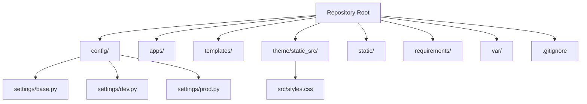
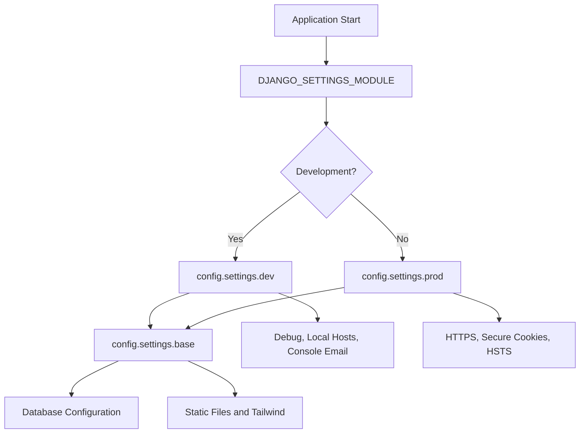

# Getting Started

<cite>
**Referenced Files in This Document**
- [README.md](file://README.md)
- [manage.py](file://manage.py)
- [config/settings/base.py](file://config/settings/base.py)
- [config/settings/dev.py](file://config/settings/dev.py)
- [config/settings/prod.py](file://config/settings/prod.py)
- [requirements/base.txt](file://requirements/base.txt)
- [requirements/dev.txt](file://requirements/dev.txt)
- [requirements/prod.txt](file://requirements/prod.txt)
- [theme/static_src/src/styles.css](file://theme/static_src/src/styles.css)
- [.gitignore](file://.gitignore)
- [pytest.ini](file://pytest.ini)
</cite>

## Table of Contents
1. [Introduction](#introduction)
2. [Project Structure](#project-structure)
3. [Prerequisites](#prerequisites)
4. [Virtual Environment Setup](#virtual-environment-setup)
5. [Installing Dependencies](#installing-dependencies)
6. [Initial Database Setup](#initial-database-setup)
7. [Development Workflow](#development-workflow)
8. [Creating a Superuser and Accessing the Admin Interface](#creating-a-superuser-and-accessing-the-admin-interface)
9. [Tailwind CSS Development](#tailwind-css-development)
10. [Testing](#testing)
11. [Development vs Production Environments](#development-vs-production-environments)
12. [Essential Commands Reference](#essential-commands-reference)
13. [Troubleshooting Guide](#troubleshooting-guide)
14. [Conclusion](#conclusion)

## Introduction
This document explains how to set up and use the Energicotel website development environment. The project is a Django 5.2 application with Tailwind CSS v4, HTMX 2, Alpine.js 3, django-unfold for the admin interface, WhiteNoise for static files, and pytest for testing. It uses PostgreSQL in production and SQLite as a local fallback during development.

The repository README describes the stack, layout, development setup, running instructions, tests, and production configuration. The settings modules define how the database, static files, security, and environment variables behave in development and production.

**Section sources**
- [README.md:1-21](file://README.md#L1-L21)
- [README.md:23-33](file://README.md#L23-L33)
- [README.md:35-81](file://README.md#L35-L81)
- [config/settings/base.py:1-8](file://config/settings/base.py#L1-L8)

## Project Structure
At a high level:
- `config/` contains Django settings (`base.py`, `dev.py`, `prod.py`), URL routing, and WSGI entry points.
- `apps/` contains feature apps such as core, team, units, news, gallery, and contact.
- `templates/` holds base templates and per-app page templates.
- `theme/static_src/src/styles.css` is the Tailwind CSS v4 entry point.
- `static/js/` holds hand-written JavaScript and vendored libraries.
- `requirements/` separates shared, development, and production dependencies.
- `var/` stores the development SQLite database file.
- `.gitignore` excludes virtual environments, secrets, runtime data, build outputs, and caches.



**Diagram sources**
- [README.md:23-33](file://README.md#L23-L33)
- [config/settings/base.py:10-20](file://config/settings/base.py#L10-L20)
- [theme/static_src/src/styles.css:1-13](file://theme/static_src/src/styles.css#L1-L13)
- [.gitignore:1-36](file://.gitignore#L1-L36)

**Section sources**
- [README.md:23-33](file://README.md#L23-L33)
- [.gitignore:1-36](file://.gitignore#L1-L36)

## Prerequisites
Before starting, ensure your system meets these requirements:

- Python 3.12 or newer.
- A terminal that supports standard commands (PowerShell on Windows, Bash/Zsh on Unix).
- Internet access for installing packages and downloading the Tailwind CLI binary on first run.

The project explicitly requires Python 3.12+ and uses Django 5.2 LTS.

**Section sources**
- [README.md:10-21](file://README.md#L10-L21)
- [README.md:35-37](file://README.md#L35-L37)

## Virtual Environment Setup
Create an isolated Python environment so project dependencies do not interfere with your system Python installation.

### Windows PowerShell
Run these commands in the repository root:

1. Create the virtual environment:
   - `python -m venv .venv`
2. Activate it:
   - `.venv\Scripts\activate`
3. Confirm activation by checking that your prompt changes to show `.venv`.

### Unix (Bash or Zsh)
Run these commands in the repository root:

1. Create the virtual environment:
   - `python3 -m venv .venv`
2. Activate it:
   - `source .venv/bin/activate`
3. Confirm activation by checking that your prompt changes to show `.venv`.

After activation, all `python` and `pip` commands will use the virtual environment.

**Section sources**
- [README.md:39-43](file://README.md#L39-L43)

## Installing Dependencies
Install the development dependencies from the requirements file. This installs shared runtime dependencies plus testing tools.

### Windows PowerShell
```powershell
pip install -r requirements\dev.txt
```

### Unix
```bash
pip install -r requirements/dev.txt
```

What gets installed:
- Shared runtime dependencies include Django, database URL support, HTMX integration, Tailwind CLI integration, template partials, the unfold admin theme, dotenv, and WhiteNoise.
- Development dependencies add pytest and pytest-django.
- Production dependencies are separate and include Gunicorn and the PostgreSQL driver.

**Section sources**
- [requirements/base.txt:1-10](file://requirements/base.txt#L1-L10)
- [requirements/dev.txt:1-6](file://requirements/dev.txt#L1-L6)
- [requirements/prod.txt:1-6](file://requirements/prod.txt#L1-L6)

## Initial Database Setup
By default, the development settings use SQLite when no `DATABASE_URL` is provided. The database file is stored under `var/db.sqlite3`.

Run migrations to create the initial database schema:

### Windows PowerShell
```powershell
python manage.py migrate
```

### Unix
```bash
python manage.py migrate
```

Important notes:
- If `DATABASE_URL` is set, Django uses that database instead of SQLite.
- Without `DATABASE_URL`, Django creates the SQLite database at `BASE_DIR/var/db.sqlite3`.
- The `var/` directory is tracked only through `.gitkeep`; the actual database file is ignored by Git.

**Section sources**
- [README.md:45-47](file://README.md#L45-L47)
- [config/settings/base.py:100-115](file://config/settings/base.py#L100-L115)
- [.gitignore:12-14](file://.gitignore#L12-L14)

## Development Workflow
The normal development workflow has two main parts: running the Django server and watching Tailwind CSS changes.

### Run the Development Server
Start the Django development server:

### Windows PowerShell
```powershell
python manage.py runserver
```

### Unix
```bash
python manage.py runserver
```

Open the site in your browser at:
- `http://127.0.0.1:8000/`

### Watch Tailwind CSS Changes
In a second terminal, keep Tailwind CSS compiled while editing styles:

### Windows PowerShell
```powershell
python manage.py tailwind watch
```

### Unix
```bash
python manage.py tailwind watch
```

The Tailwind entry file is `theme/static_src/src/styles.css`. Its output is written to `theme/static_src/dist/css/styles.css`, which is served as `/static/css/styles.css` through the Tailwind template tag.

**Section sources**
- [README.md:53-61](file://README.md#L53-L61)
- [theme/static_src/src/styles.css:1-13](file://theme/static_src/src/styles.css#L1-L13)
- [config/settings/base.py:141-168](file://config/settings/base.py#L141-L168)

## Creating a Superuser and Accessing the Admin Interface
The admin interface uses django-unfold.

1. Create a superuser account:

### Windows PowerShell
```powershell
python manage.py createsuperuser
```

### Unix
```bash
python manage.py createsuperuser
```

2. Start the development server if it is not already running.
3. Open the admin interface in your browser:
   - `http://127.0.0.1:8000/admin/`
4. Log in with the superuser credentials you created.

**Section sources**
- [README.md:60-61](file://README.md#L60-L61)

## Tailwind CSS Development
Tailwind CSS v4 is configured through `django-tailwind-cli`. You do not need Node.js for this project.

Key paths:
- Source file: `theme/static_src/src/styles.css`
- Built output: `theme/static_src/dist/css/styles.css`
- Served URL: `/static/css/styles.css`

Commands:
- Build once:
  - Windows PowerShell: `python manage.py tailwind build`
  - Unix: `python manage.py tailwind build`
- Watch and rebuild on change:
  - Windows PowerShell: `python manage.py tailwind watch`
  - Unix: `python manage.py tailwind watch`

The source file imports Tailwind and defines content sources. It also contains a `@theme` block where design tokens such as colors, fonts, type scale, shape, layout, and breakpoints are defined.

**Section sources**
- [README.md:45-48](file://README.md#L45-L48)
- [README.md:55-58](file://README.md#L55-L58)
- [theme/static_src/src/styles.css:1-39](file://theme/static_src/src/styles.css#L1-L39)
- [config/settings/base.py:141-168](file://config/settings/base.py#L141-L168)

## Testing
Tests use pytest with pytest-django. The test configuration sets the Django settings module to development settings.

Run tests:

### Windows PowerShell
```powershell
pytest
```

### Unix
```bash
pytest
```

Notes:
- Tests run against `config.settings.dev`.
- Test discovery includes files named `tests.py`, `test_*.py`, and `*_tests.py`.
- Strict markers are enabled by default.

**Section sources**
- [README.md:63-67](file://README.md#L63-L67)
- [pytest.ini:1-5](file://pytest.ini#L1-L5)

## Development vs Production Environments
The project separates configuration into base, development, and production settings.

| Aspect | Development | Production |
|---|---|---|
| Settings module | `config.settings.dev` | `config.settings.prod` |
| Debug mode | Enabled | Disabled |
| Database | SQLite fallback unless `DATABASE_URL` is set | Requires `DATABASE_URL` pointing to PostgreSQL |
| Static files | Served directly from source directories; no `collectstatic` required | Collected and compressed with hashed filenames |
| Security | Relaxed defaults for local development | Hardened HTTPS, session, CSRF, HSTS, and proxy settings |
| Required environment variables | Optional `.env` values; defaults exist | `SECRET_KEY`, `ALLOWED_HOSTS`, `DATABASE_URL`, and optionally `CSRF_TRUSTED_ORIGINS` |

### How the settings work
- `base.py` loads environment variables, configures apps, middleware, templates, database, static files, and Tailwind CLI options.
- `dev.py` enables debug mode, allows localhost hosts, serves static files without collection, prints emails to the console, and uses plain static URLs.
- `prod.py` requires secure environment variables, enforces PostgreSQL via `DATABASE_URL`, adds connection tuning, and applies security hardening.



**Diagram sources**
- [config/settings/base.py:10-20](file://config/settings/base.py#L10-L20)
- [config/settings/base.py:100-115](file://config/settings/base.py#L100-L115)
- [config/settings/base.py:141-168](file://config/settings/base.py#L141-L168)
- [config/settings/dev.py:1-36](file://config/settings/dev.py#L1-L36)
- [config/settings/prod.py:1-50](file://config/settings/prod.py#L1-L50)

**Section sources**
- [manage.py:8-20](file://manage.py#L8-L20)
- [config/settings/base.py:10-20](file://config/settings/base.py#L10-L20)
- [config/settings/base.py:100-115](file://config/settings/base.py#L100-L115)
- [config/settings/base.py:141-168](file://config/settings/base.py#L141-L168)
- [config/settings/dev.py:1-36](file://config/settings/dev.py#L1-L36)
- [config/settings/prod.py:1-50](file://config/settings/prod.py#L1-L50)

## Essential Commands Reference
Use this table as a quick reference for common tasks.

| Task | Windows PowerShell | Unix | Notes |
|---|---|---|---|
| Create virtual environment | `python -m venv .venv` | `python3 -m venv .venv` | Activate before installing dependencies |
| Install development dependencies | `pip install -r requirements\dev.txt` | `pip install -r requirements/dev.txt` | Includes base and test dependencies |
| Run migrations | `python manage.py migrate` | `python manage.py migrate` | Creates or updates the database schema |
| Build Tailwind CSS | `python manage.py tailwind build` | `python manage.py tailwind build` | Compiles `theme/static_src/src/styles.css` |
| Watch Tailwind CSS | `python manage.py tailwind watch` | `python manage.py tailwind watch` | Rebuilds on style changes |
| Run development server | `python manage.py runserver` | `python manage.py runserver` | Default URL is `http://127.0.0.1:8000/` |
| Create superuser | `python manage.py createsuperuser` | `python manage.py createsuperuser` | Required for admin access |
| Run tests | `pytest` | `pytest` | Uses pytest-django with dev settings |
| Collect static files | `python manage.py collectstatic --noinput` | `python manage.py collectstatic --noinput` | Mainly needed in production |

**Section sources**
- [README.md:39-67](file://README.md#L39-L67)
- [README.md:75-79](file://README.md#L75-L79)

## Troubleshooting Guide

### WhiteNoise Warning About Missing Staticfiles Directory
On a fresh clone, WhiteNoise may print a warning about a missing `staticfiles` directory. This is harmless in development until you run `collectstatic`.

What to do:
- Ignore the warning during normal development.
- Run `python manage.py collectstatic --noinput` if you need a collected static directory.

Why this happens:
- In development, static files are served directly from source directories.
- The warning appears because the production-style storage expects a collected static directory.

**Section sources**
- [README.md:50-51](file://README.md#L50-L51)
- [config/settings/dev.py:15-23](file://config/settings/dev.py#L15-L23)
- [config/settings/base.py:141-157](file://config/settings/base.py#L141-L157)

### Tailwind CLI Download Issues
The first time you run `python manage.py tailwind build`, the package downloads the Tailwind CLI binary.

Common issues:
- Network restrictions prevent downloading the CLI.
- Corrupted cached CLI binary.

What to do:
- Ensure you have internet access on the first build.
- Clear the Tailwind CLI cache directory `.django_tailwind_cli/` if builds fail repeatedly.
- Re-run `python manage.py tailwind build`.

Relevant behavior:
- The CLI version is pinned in settings.
- The binary is cached and re-downloaded only on version changes.

**Section sources**
- [README.md:45-48](file://README.md#L45-L48)
- [config/settings/base.py:159-168](file://config/settings/base.py#L159-L168)
- [.gitignore:19-24](file://.gitignore#L19-L24)

### Database Connection Problems
If the application cannot connect to the database:

Check whether you are using SQLite or PostgreSQL:
- Without `DATABASE_URL`, Django uses SQLite at `var/db.sqlite3`.
- With `DATABASE_URL`, Django parses the URL and connects to the configured database.

Steps:
1. Verify `DATABASE_URL` is set correctly if you intend to use PostgreSQL.
2. For local development without PostgreSQL, leave `DATABASE_URL` unset so SQLite is used.
3. Run migrations after changing database configuration:
   - `python manage.py migrate`
4. Check that the `var/` directory exists and is writable.

Production-specific checks:
- Production requires `DATABASE_URL`.
- Production adds connection max age and health checks.

**Section sources**
- [config/settings/base.py:100-115](file://config/settings/base.py#L100-L115)
- [config/settings/prod.py:24-27](file://config/settings/prod.py#L24-L27)
- [.gitignore:12-14](file://.gitignore#L12-L14)

### Admin Page Not Loading or Showing Incorrect Styles
Make sure:
- The development server is running.
- Tailwind CSS has been built or is being watched.
- You have created a superuser.
- The admin URL is `http://127.0.0.1:8000/admin/`.

**Section sources**
- [README.md:53-61](file://README.md#L53-L61)

### Tests Fail Because Django Is Not Installed
If `manage.py` reports that Django cannot be imported:
- Confirm the virtual environment is activated.
- Confirm dependencies were installed from `requirements/dev.txt`.
- Run `pip install -r requirements/dev.txt` again if needed.

**Section sources**
- [manage.py:8-20](file://manage.py#L8-L20)
- [requirements/dev.txt:1-6](file://requirements/dev.txt#L1-L6)

## Conclusion
You now have the essential information to set up the Energicotel website locally, run the development server, compile Tailwind CSS, create an admin user, and run tests. Use development settings for local work and production settings behind Gunicorn and Nginx for deployment. When troubleshooting, focus on the virtual environment, dependency installation, database configuration, Tailwind CLI availability, and static file handling.