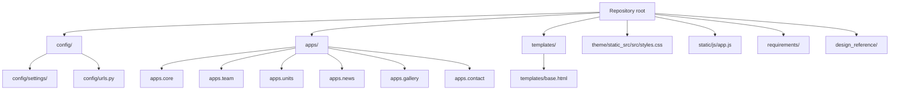
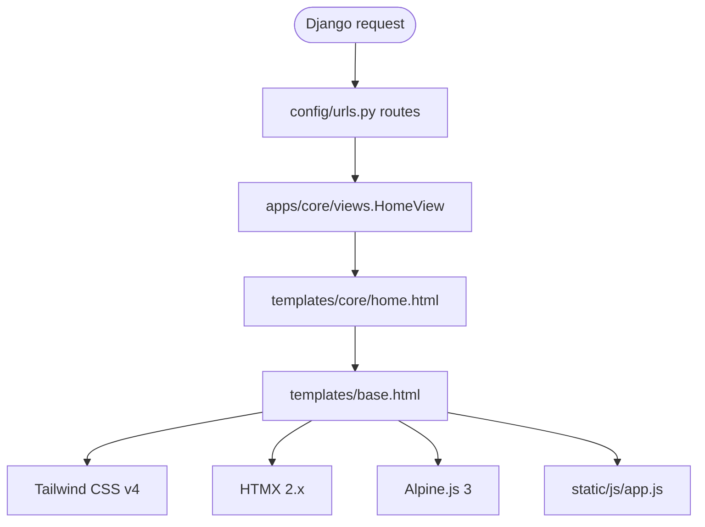
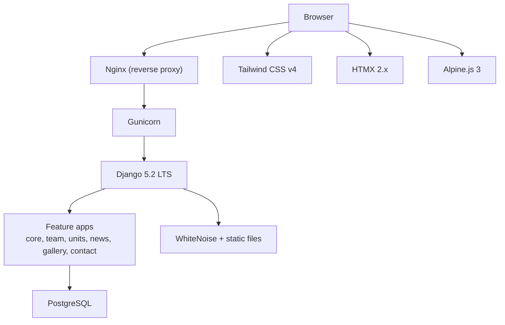
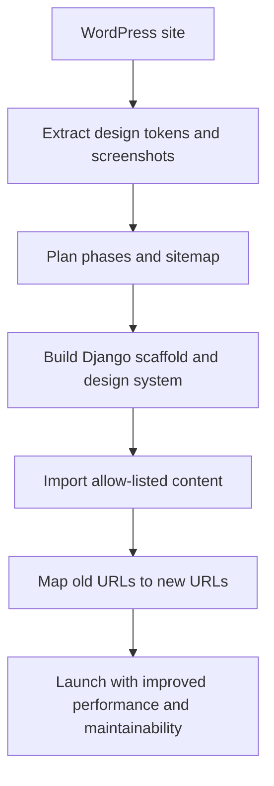
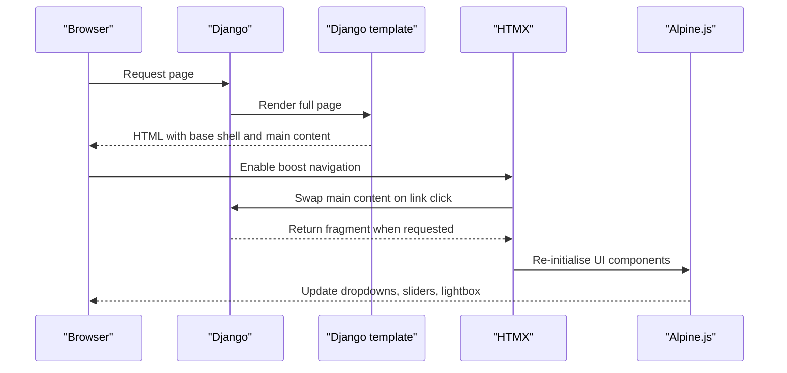
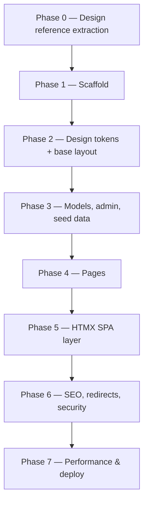
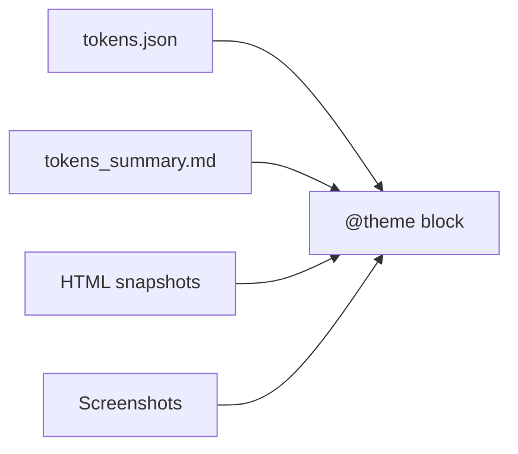
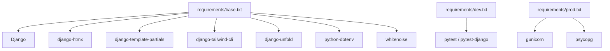

# Project Overview

<cite>
**Referenced Files in This Document**
- [README.md](file://README.md)
- [CLAUDE.md](file://CLAUDE.md)
- [config/settings/base.py](file://config/settings/base.py)
- [config/urls.py](file://config/urls.py)
- [apps/core/models.py](file://apps/core/models.py)
- [apps/core/views.py](file://apps/core/views.py)
- [apps/team/models.py](file://apps/team/models.py)
- [apps/units/models.py](file://apps/units/models.py)
- [apps/news/models.py](file://apps/news/models.py)
- [apps/gallery/models.py](file://apps/gallery/models.py)
- [apps/contact/models.py](file://apps/contact/models.py)
- [templates/base.html](file://templates/base.html)
- [theme/static_src/src/styles.css](file://theme/static_src/src/styles.css)
- [static/js/app.js](file://static/js/app.js)
- [requirements/base.txt](file://requirements/base.txt)
- [requirements/dev.txt](file://requirements/dev.txt)
- [requirements/prod.txt](file://requirements/prod.txt)
</cite>

## Table of Contents
1. [Introduction](#introduction)
2. [Project Structure](#project-structure)
3. [Core Components](#core-components)
4. [Architecture Overview](#architecture-overview)
5. [Detailed Component Analysis](#detailed-component-analysis)
6. [Dependency Analysis](#dependency-analysis)
7. [Performance Considerations](#performance-considerations)
8. [Troubleshooting Guide](#troubleshooting-guide)
9. [Conclusion](#conclusion)

## Introduction
This document describes the Energicotel website project: a Django-based rebuild and migration from the existing WordPress + Elementor site for Energicotel PLC, an energy company listed on the Rwanda Stock Exchange. The repository is currently at Phase 1 scaffold status. No page content has been built yet; page implementation begins in Phase 2 according to the project specification.

The project purpose is to replace the legacy WordPress build with a modern, maintainable stack while preserving visual parity with the live site. It uses progressive enhancement so that every page works without JavaScript, then gains SPA-like navigation through HTMX when JS is available.

Key goals include:
- Maintaining design fidelity using extracted design tokens and screenshots.
- Improving performance, security, and long-term maintainability.
- Providing a clean URL structure with permanent redirects from old WordPress URLs.
- Preparing for future phases such as content import, SEO, and production deployment.

**Section sources**
- [README.md:1-9](file://README.md#L1-L9)
- [CLAUDE.md:1-17](file://CLAUDE.md#L1-L17)

## Project Structure
The repository follows a standard Django layout with feature-oriented apps under `apps/`, environment-specific settings under `config/settings/`, reusable templates under `templates/`, Tailwind CSS source under `theme/static_src/src/`, and committed design reference material under `design_reference/`.

**Diagram sources**
- [config/settings/base.py:37-57](file://config/settings/base.py#L37-L57)
- [config/urls.py:12-17](file://config/urls.py#L12-L17)
- [templates/base.html:1-24](file://templates/base.html#L1-L24)
- [theme/static_src/src/styles.css:15-38](file://theme/static_src/src/styles.css#L15-L38)
- [static/js/app.js:1-8](file://static/js/app.js#L1-L8)

The top-level layout is documented in the README and the project specification. The apps are core, team, units, news, gallery, and contact. Configuration includes base, dev, and prod settings plus URL routing and WSGI entry points. Design reference materials include HTML snapshots, screenshots, and tokens used to preserve visual parity during migration.

**Section sources**
- [README.md:23-33](file://README.md#L23-L33)
- [CLAUDE.md:246-271](file://CLAUDE.md#L246-L271)

## Core Components
The current codebase provides a working scaffold rather than full pages:

- **Configuration**: Shared Django settings define installed apps, middleware, template configuration, database connection via `DATABASE_URL` with SQLite fallback, static file handling with WhiteNoise, and Tailwind CLI integration.
- **URL routing**: The root URL maps to a placeholder home view. Admin is enabled with customised headers.
- **Apps**: Each app directory exists with models, views, migrations, admin, and apps configuration files. Most model files contain comments describing planned models for later phases.
- **Templates**: A base template loads Tailwind CSS, vendored HTMX 2, Alpine.js 3, and the application JavaScript. It reserves a main content block for page content.
- **Design system**: The Tailwind entry file imports Tailwind, declares source paths, and defines an empty `@theme` block ready for Phase 2 token values.
- **JavaScript**: The application script is present but reserved for Phase 5 progressive enhancement wiring.

**Diagram sources**
- [config/urls.py:12-17](file://config/urls.py#L12-L17)
- [apps/core/views.py:6-13](file://apps/core/views.py#L6-L13)
- [templates/base.html:10-22](file://templates/base.html#L10-L22)

**Section sources**
- [config/settings/base.py:37-71](file://config/settings/base.py#L37-L71)
- [config/settings/base.py:81-98](file://config/settings/base.py#L81-L98)
- [config/settings/base.py:104-115](file://config/settings/base.py#L104-L115)
- [config/settings/base.py:141-168](file://config/settings/base.py#L141-L168)
- [config/urls.py:1-17](file://config/urls.py#L1-L17)
- [apps/core/views.py:1-14](file://apps/core/views.py#L1-L14)
- [apps/core/models.py:1-5](file://apps/core/models.py#L1-L5)
- [apps/team/models.py:1-5](file://apps/team/models.py#L1-L5)
- [apps/units/models.py:1-5](file://apps/units/models.py#L1-L5)
- [apps/news/models.py:1-6](file://apps/news/models.py#L1-L6)
- [apps/gallery/models.py:1-5](file://apps/gallery/models.py#L1-L5)
- [apps/contact/models.py:1-5](file://apps/contact/models.py#L1-L5)
- [templates/base.html:1-24](file://templates/base.html#L1-L24)
- [theme/static_src/src/styles.css:1-38](file://theme/static_src/src/styles.css#L1-L38)
- [static/js/app.js:1-8](file://static/js/app.js#L1-L8)

## Architecture Overview
The architectural approach is progressive enhancement:

- Pages render fully server-side using Django templates.
- When JavaScript is available, HTMX enables SPA-like navigation by swapping only the main content area.
- Alpine.js handles small UI state such as dropdowns, mobile drawers, lightboxes, and tabs.
- Tailwind CSS v4 centralises design tokens so colours, typography, spacing, and breakpoints come from one place.
- PostgreSQL is the production database, with SQLite used as a development fallback.
- WhiteNoise serves static assets, and Gunicorn runs behind Nginx in production.

**Diagram sources**
- [README.md:10-21](file://README.md#L10-L21)
- [README.md:69-81](file://README.md#L69-L81)
- [config/settings/base.py:37-71](file://config/settings/base.py#L37-L71)
- [config/settings/base.py:104-115](file://config/settings/base.py#L104-L115)
- [config/settings/base.py:141-168](file://config/settings/base.py#L141-L168)
- [requirements/base.txt:1-10](file://requirements/base.txt#L1-L10)
- [requirements/prod.txt:1-6](file://requirements/prod.txt#L1-L6)

## Detailed Component Analysis

### Technology Stack
The stack combines a mature backend framework with a modern frontend toolchain:

| Layer | Choice | Purpose |
|---|---|---|
| Backend | Django 5.2 LTS | Web framework, routing, ORM, templates, admin |
| Database | PostgreSQL via `DATABASE_URL`; SQLite fallback | Production data store with convenient local development |
| CSS | Tailwind CSS v4 via django-tailwind-cli | Utility-first styling with a single `@theme` token block |
| Interactivity | HTMX 2.x + Alpine.js 3 | Progressive enhancement and lightweight UI state |
| Templates | Django templates + django-template-partials | Reusable fragments and HTMX partial responses |
| Admin | django-unfold | Modern Django admin theme |
| Static files | WhiteNoise | Efficient static asset serving |
| Tests | pytest + pytest-django | Test runner and Django test utilities |

**Section sources**
- [README.md:10-21](file://README.md#L10-L21)
- [requirements/base.txt:1-10](file://requirements/base.txt#L1-L10)
- [requirements/dev.txt:1-6](file://requirements/dev.txt#L1-L6)
- [requirements/prod.txt:1-6](file://requirements/prod.txt#L1-L6)

### Migration Strategy from WordPress
The migration replaces WordPress + Elementor with a semantic, maintainable Django build while keeping the same look and navigation. Key aspects include:

- **Visual parity first**: Colors, fonts, sizes, spacing, and layout must match the live site using extracted tokens and screenshots.
- **No Elementor markup**: Rebuild sections with semantic HTML and Tailwind utilities.
- **Allow-listed content**: Only approved WordPress posts are imported; spam content is excluded.
- **Clean URLs and redirects**: Old query-string URLs map to new slugs with 301 redirects; known spam URLs return 410 Gone.
- **Content fixes**: Typos, incorrect conversions, placeholder stats, and external image references are corrected or flagged for confirmation.
- **Media handling**: Images are downloaded, renamed, optimised, and mapped back to old URLs for redirects.

**Diagram sources**
- [CLAUDE.md:41-99](file://CLAUDE.md#L41-L99)
- [CLAUDE.md:102-124](file://CLAUDE.md#L102-L124)
- [CLAUDE.md:301-307](file://CLAUDE.md#L301-L307)

**Section sources**
- [CLAUDE.md:9-17](file://CLAUDE.md#L9-L17)
- [CLAUDE.md:41-99](file://CLAUDE.md#L41-L99)
- [CLAUDE.md:102-124](file://CLAUDE.md#L102-L124)
- [CLAUDE.md:301-307](file://CLAUDE.md#L301-L307)

### Progressive Enhancement and HTMX Approach
Pages work without JavaScript. When JS is available, HTMX enhances navigation by swapping only the main content area, updating the document title, managing focus, and reinitialising interactive components. Alpine.js handles small client-side interactions.

**Diagram sources**
- [templates/base.html:10-22](file://templates/base.html#L10-L22)
- [static/js/app.js:1-8](file://static/js/app.js#L1-L8)
- [CLAUDE.md:275-298](file://CLAUDE.md#L275-L298)

**Section sources**
- [CLAUDE.md:14-14](file://CLAUDE.md#L14-L14)
- [CLAUDE.md:275-298](file://CLAUDE.md#L275-L298)
- [templates/base.html:10-22](file://templates/base.html#L10-L22)
- [static/js/app.js:1-8](file://static/js/app.js#L1-L8)

### Current Phase 1 Scaffold Status
Phase 1 establishes the project foundation:

- Django project with shared settings split across base, dev, and prod.
- Feature apps registered: core, team, units, news, gallery, contact.
- HTMX middleware and template partials configured.
- Tailwind CLI integrated with a source CSS file ready for token values.
- Base template loading Tailwind, HTMX, Alpine, and application JavaScript.
- Placeholder home view and root URL route.
- No page content implemented yet; page work starts in Phase 2.

**Diagram sources**
- [CLAUDE.md:310-337](file://CLAUDE.md#L310-L337)
- [README.md:6-8](file://README.md#L6-L8)

**Section sources**
- [README.md:6-8](file://README.md#L6-L8)
- [CLAUDE.md:315-317](file://CLAUDE.md#L315-L317)
- [config/settings/base.py:37-57](file://config/settings/base.py#L37-L57)
- [config/urls.py:12-17](file://config/urls.py#L12-L17)
- [apps/core/views.py:6-13](file://apps/core/views.py#L6-L13)

### Design Reference Materials
Design reference materials support visual parity during migration:

- `design_reference/html/` contains HTML snapshots of key pages.
- `design_reference/screenshots/` captures desktop, tablet, and mobile views.
- `design_reference/tokens.json` and `design_reference/tokens_summary.md` provide extracted design values.
- The Tailwind `@theme` block is intentionally left empty until Phase 2 fills it with exact values.

**Diagram sources**
- [CLAUDE.md:191-243](file://CLAUDE.md#L191-L243)
- [theme/static_src/src/styles.css:26-38](file://theme/static_src/src/styles.css#L26-L38)

**Section sources**
- [CLAUDE.md:93-99](file://CLAUDE.md#L93-L99)
- [CLAUDE.md:191-243](file://CLAUDE.md#L191-L243)
- [theme/static_src/src/styles.css:1-38](file://theme/static_src/src/styles.css#L1-L38)

## Dependency Analysis
The runtime dependencies are pinned in requirements files and wired into Django settings:

- `Django==5.2.17` is the core framework.
- `django-htmx` exposes HTMX request information to views and templates.
- `django-template-partials` supports reusable template fragments.
- `django-tailwind-cli` builds Tailwind CSS without Node.js.
- `django-unfold` themes the Django admin.
- `python-dotenv` loads local `.env` variables.
- `whitenoise` serves static files efficiently.
- Development adds pytest and pytest-django.
- Production adds Gunicorn and psycopg for PostgreSQL.

**Diagram sources**
- [requirements/base.txt:1-10](file://requirements/base.txt#L1-L10)
- [requirements/dev.txt:1-6](file://requirements/dev.txt#L1-L6)
- [requirements/prod.txt:1-6](file://requirements/prod.txt#L1-L6)

**Section sources**
- [requirements/base.txt:1-10](file://requirements/base.txt#L1-L10)
- [requirements/dev.txt:1-6](file://requirements/dev.txt#L1-L6)
- [requirements/prod.txt:1-6](file://requirements/prod.txt#L1-L6)
- [config/settings/base.py:37-57](file://config/settings/base.py#L37-L57)

## Performance Considerations
Performance guidance is outlined in the project specification and README:

- Use WebP images with responsive `srcset`.
- Lazy-load images where appropriate.
- Self-host fonts with `font-display: swap` and preload critical fonts.
- Keep CSS minified and avoid arbitrary values in templates.
- Defer non-critical JavaScript.
- Target strong Lighthouse scores in production.
- Serve static files through WhiteNoise and collect static assets before deployment.

These recommendations apply after Phase 7 implementation and testing.

[No sources needed since this section provides general guidance]

## Troubleshooting Guide
Common operational notes include:

- **Development setup**: Create a virtual environment, install development requirements, migrate the database, and build Tailwind CSS.
- **Running the server**: Use the Django development server and Tailwind watch mode separately.
- **Admin access**: Create a superuser and visit the admin path.
- **Tests**: Run pytest from the project root.
- **Production**: Set required environment variables, build CSS, collect static files, and run Gunicorn behind Nginx with Cloudflare in front.
- **Vendored JavaScript**: HTMX and Alpine.js are pinned copies stored locally to keep the site self-hosted.

**Section sources**
- [README.md:35-67](file://README.md#L35-L67)
- [README.md:69-94](file://README.md#L69-L94)

## Conclusion
The Energicotel website project is a carefully scoped migration from WordPress + Elementor to a Django-based platform. At Phase 1, the repository provides a solid scaffold, configuration structure, app layout, base template, and design system entry point. Future phases will fill design tokens, implement models and admin, build pages, add HTMX-driven SPA behaviour, handle SEO and redirects, and prepare for production deployment. The result should be a faster, more secure, and easier-to-maintain site that preserves the visual identity of Energicotel PLC while improving performance and long-term engineering quality.

[No sources needed since this section summarizes without analyzing specific files]